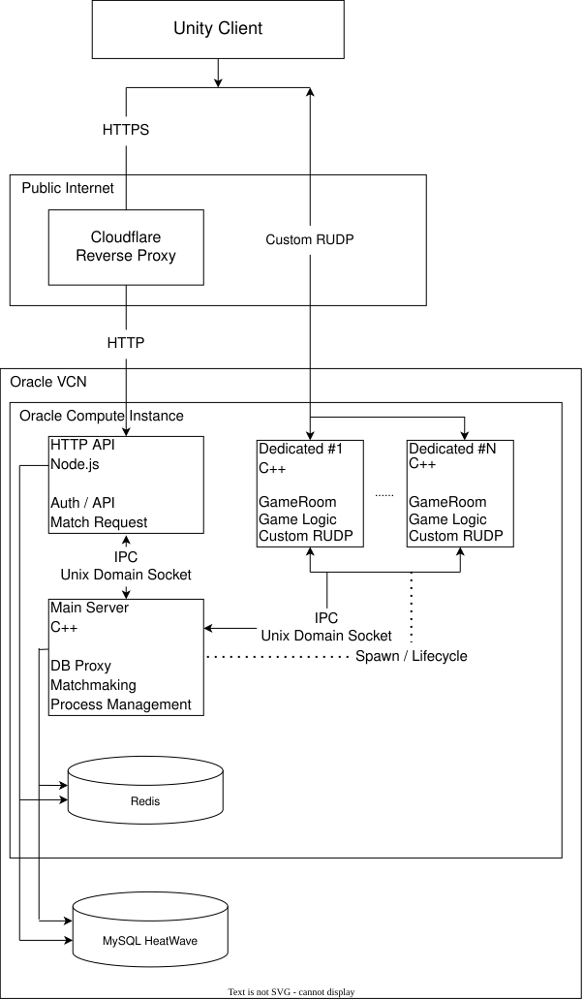

# Extraction Shooter

Linux C++ 게임 서버와 Unity 클라이언트로 구축한 멀티플레이어 Extraction Shooter 프로젝트입니다.

비동기 네트워킹, Custom RUDP, Matchmaking, Dedicated Game Server, DB 연동 등을 직접 설계 및 구현하고, 이를 실제 Public Cloud 환경에 배포하여 단순한 로컬 테스트를 넘어 외부 사용자가 접속하고 플레이할 수 있는 온라인 멀티플레이 환경을 구축하는 데 중점을 두었습니다.

[다운로드 - Google Drive]

[게임 플레이 GIF / 영상]

## Overview

이 저장소는 1인 개발로 진행한 멀티플레이어 Extraction Shooter 프로젝트의 **서버측 구현**입니다.

Linux C++ 기반의 실시간 게임 서버를 중심으로 HTTP API, Matchmaking, Dedicated Game Server, 데이터 계층 및 Public Cloud 배포 환경까지 구성했습니다.

주요 구현 영역은 다음과 같습니다.

- **Linux C++ Multiplayer Server Architecture**
  - `io_uring` 기반 비동기 네트워킹
  - Main Server, Node.js HTTP API Server, 다수의 Dedicated Game Server Process로 구성
- **Custom RUDP Transport**
  - ACK 및 재전송을 지원하는 Reliable Channel
  - 패킷 유실을 허용하고 최신 상태 전달을 우선하는 Unreliable Channel
  - HTTPS를 통해 공유한 세션 키 기반의 경량 Packet Signature 검증
- **Matchmaking System**
  - 플레이어의 공격 성향과 대기시간을 기반으로 한 Matchmaking
- **Dynamic Dedicated Process Management**
  - 활성 세션 수에 따라 Dedicated Process를 동적으로 생성하고 GameRoom 할당
- **Game State & Item Lifecycle**
  - Lobby의 영속 상태와 Match 내부의 일시적인 상태를 분리하여 관리
- **Public Cloud Deployment**
  - Cloudflare Reverse Proxy
  - Oracle Compute Instance
  - Redis
  - MySQL HeatWave

## Architecture



## Engineering Highlights

### 1. Multi-Process Server Architecture

서버의 역할과 장애 범위를 분리하기 위해 **Main Server, HTTP API Server, Dedicated Game Server​**를 각각 별도의 프로세스로 구성했습니다.

#### HTTP API Server

공개 인터넷에서 최초 접점이 되는 계정 생성 및 인증, Matchmaking 요청, 게임 아이템 검증, 게임 접속 준비 및 키 교환 등의 작업은 별도의 **Node.js HTTP API Server**에서 처리합니다.

외부 클라이언트는 Cloudflare Reverse Proxy를 통해 HTTPS API를 사용하며, 실시간 게임 서버와 인증·계정·API 영역의 책임을 분리했습니다.

이를 통해 Main Server는 Matchmaking 및 Process 조율에, Dedicated Game Server는 실시간 Game Logic 처리에 집중하도록 구성했습니다.

#### Dedicated Game Server

실제 클라이언트와 Custom RUDP로 직접 통신하는 영역은 별도의 Dedicated Process로 격리했습니다.

각 Dedicated Process는 제한된 수의 플레이어와 GameRoom을 담당하며, 하나의 프로세스에서 발생한 장애가 다른 게임 세션이나 Main Server로 직접 확산되는 범위를 줄이도록 설계했습니다.

또한 Dedicated Process에는 Redis와 MySQL에 대한 직접 접근 권한을 두지 않았습니다.

데이터 작업이 필요한 경우 Unix Domain Socket IPC를 통해 Main Server의 **DB Proxy**에 요청하도록 구성하여, Dedicated Process의 데이터 접근 범위를 제한하고 DB 작업과 실시간 Game Logic의 책임을 분리했습니다.

기존 Dedicated Process가 추가 세션을 수용할 수 없는 경우 Main Server가 새로운 Dedicated Process를 생성하고, 초기화가 완료된 프로세스에 새로운 GameRoom을 할당합니다.

#### GameRoom Lifecycle

GameRoom은 플레이어의 탈출, 사망, 연결 종료 및 Match Timeout 등 여러 종료 경로를 처리합니다.

어떤 경로로든 Room 내부의 플레이어가 모두 제거되면 해당 GameRoom은 자원 회수 절차에 들어가며, Dedicated Process는 확보된 수용 가능 인원을 Main Server에 IPC로 통지합니다.

이를 통해 Main Server는 새로운 Dedicated Process를 생성하는 것뿐 아니라, 기존 Dedicated Process에서 회수된 Capacity를 다시 Match 결과 할당에 활용할 수 있도록 구성했습니다.

### 2. Custom RUDP Transport

실시간 FPS 게임에서는 TCP처럼 모든 데이터에 동일한 순서 보장과 재전송을 적용하는 방식이 적합하지 않다고 판단했습니다.

위치나 방향처럼 지속적으로 갱신되는 데이터는 일부 패킷이 유실되더라도 이후의 최신 상태로 보완할 수 있습니다. 반면 반드시 전달되어야 하는 중요한 데이터가 별도의 처리 없이 유실되는 것 역시 허용하기 어렵습니다.

이 문제를 해결하기 위해 **GameNetworkingSockets의 전송 모델에서 영감을 받아 Reliable / Unreliable Channel을 분리한 자체 RUDP 전송 계층**을 구현했습니다.

- **Reliable Channel**
  - Sequence 기반 패킷 관리
  - ACK 처리
  - ACK를 받지 못한 패킷 재전송
- **Unreliable Channel**
  - 패킷 유실 허용
  - 재전송으로 인한 지연 없이 최신 상태 전달을 우선

이를 통해 모든 패킷에 신뢰성을 강제하지 않으면서도, 반드시 전달되어야 하는 데이터에는 필요한 수준의 전달 보장을 적용하도록 구성했습니다.

#### Lightweight Packet Signature

실시간 패킷 전체에 별도의 암호화를 적용하지 않는 대신, 게임 접속 직전에 HTTPS를 통해 클라이언트와 공유한 `securityKey`를 이용하여 세션별 Packet Signature를 검증합니다.

RUDP Packet Header의 첫 8 Byte를 Signature 영역으로 사용합니다.

송신 시 Signature 영역을 0으로 설정한 Application-level Packet 전체에 대해 다음 값을 계산하고, 결과를 Signature 영역에 기록합니다.

`XXH64(packet, size, securityKey)`

수신 측에서도 동일한 `securityKey`를 seed로 사용하여 Signature를 다시 계산하며, 수신된 값과 일치하지 않는 패킷은 처리하지 않고 폐기합니다.

이 방식은 잘못된 패킷이나 세션과 일치하지 않는 패킷을 낮은 비용으로 검증하기 위한 경량 메커니즘이며, 암호학적으로 검증된 MAC을 대체하기 위한 구조는 아닙니다.

#### Duplicate Delivery Handling

Reliable Channel은 ACK 유실에 따른 재전송 과정에서 동일한 패킷이 두 번 이상 수신될 수 있습니다.

따라서 Reliable Packet Handler는 가능한 경우 **멱등하게 동작하도록 설계**하고, 완전한 멱등 처리가 어려운 경우에도 동일 패킷의 중복 수신이 의도하지 않은 Side Effect를 반복해서 발생시키지 않도록 구성했습니다.

클라이언트는 주기적으로 Heartbeat Packet을 전송하여 연결 상태를 확인하며, ACK 처리와 재전송이 지속적으로 이루어질 수 있도록 구성했습니다.

### 3. `io_uring` Async Networking

Linux에서 비동기 네트워크 I/O를 구현하기 위해 `epoll`과 `io_uring`을 검토했습니다.

두 방식 중 단순한 성능 우위를 전제로 선택하기보다는, 이전 프로젝트에서 사용했던 Windows IOCP의 **작업 제출 → 완료 통지 → 후처리** 구조와 유사한 형태로 서버를 설계할 수 있다는 점을 고려하여 `io_uring`을 선택했습니다.

I/O 작업의 종류와 관계없이 완료 처리를 통합하기 위해 `IOTask`라는 공통 인터페이스를 두고, UDP Session의 Recv / Send, IPC Session의 Recv / Send / Accept 등 각 작업의 성격에 따라 파생 Task를 구현했습니다.

각 `IOTask`는 I/O 완료 이후 실행할 Callback과 후처리에 필요한 상태를 보관합니다.

I/O 요청을 제출할 때 해당 Task를 SQE의 `user_data`와 연결하고, 완료된 CQE를 처리할 때 다시 Task를 찾아 Callback을 실행합니다.

```text
IOTask
  ↓
SQE (user_data → IOTask)
  ↓
Submission Queue
  ↓
Kernel I/O
  ↓
Completion Queue (CQE)
  ↓
user_data → IOTask
  ↓
Callback / Post Processing
```

Recv / Send와 같은 I/O Task는 높은 빈도로 생성되고 소멸할 것이 예상되었기 때문에, 반복적인 동적 메모리 할당을 줄이기 위해 Task 객체를 **Object Pool**로 관리하도록 구성했습니다.

## Matchmaking System

ARC Raiders를 플레이하며 체감한 플레이어 간 우호·공격 성향에 따른 게임 경험에서 영감을 받아, 다른 플레이어를 얼마나 공격적으로 대하는지를 나타내는 `aggression`을 주요 Matchmaking 지표로 사용했습니다.

MatchMaker의 목표는 비슷한 `aggression`을 가진 플레이어를 최대한 같은 Room에 배치하는 것입니다.

다만 매칭 품질 때문에 사용자를 무한히 대기시키지 않도록 대기시간이 증가할수록 필요한 인원 조건을 단계적으로 완화하고, 최종적으로 Solo Match도 허용합니다.

반면 `aggression` 차이는 일정 범위 이상 완화하지 않습니다. 지나치게 다른 성향의 플레이어를 억지로 같은 Room에 배치하기보다는 인원이 적더라도 게임을 시작시키는 편이 더 적합하다고 판단했습니다.

### Queue 탐색

장기간 Matchmaking Queue의 크기에 영향을 주는 것은 매칭에 성공해 Queue에서 제거되는 Ticket보다, **매칭에 실패해 지속적으로 Queue에 누적되는 Ticket**이라고 판단했습니다.

Matchmaking Queue는 `aggression`별 FIFO Bucket으로 관리하며, 각 Bucket에서 가장 오래 기다린 플레이어를 Pivot으로 사용합니다.

현재 조건에서 Pivot이 매칭에 실패했다면, 같은 `aggression`을 가지면서 대기시간이 더 짧은 뒤쪽 플레이어 역시 해당 Match Cycle에서는 매칭할 수 없으므로 추가 탐색을 생략합니다.

이를 통해 매칭 실패가 누적되는 경로에서 불필요한 반복 탐색을 제한합니다.

현재 구현 전체가 항상 O(N)으로 동작하는 것은 아닙니다. 한 Bucket에서 매칭 성공이 집중될 경우 이미 매칭된 Ticket을 반복해서 건너뛰면서 최악 O(N²)의 탐색이 발생할 수 있습니다.

다만 장기간 Queue에 누적될 수 있는 **매칭 실패 경로의 탐색 비용을 억제하는 것**을 우선적인 설계 목표로 두었습니다.

### Match State Consistency

Match Cancel 요청과 MatchMaker의 결정은 동시에 발생할 수 있기 때문에 C++ 메모리의 상태만을 최종 상태로 사용하지 않습니다.

Redis의 Match Ticket을 Source of Truth로 사용하며, Lua Script를 통해 Match Group 전체가 여전히 `WAITING` 상태인지 원자적으로 검증한 뒤 `INPROGRESS`로 전환합니다.

```text
WAITING
   │
   │ Match 확정
   ▼
INPROGRESS
   │
   │ Dedicated Server 할당
   │ GameRoom 편입 완료
   ▼
SUCCESS
```

- **WAITING**
  - Matchmaking 대기 상태
  - 사용자 Match Cancel 가능
- **INPROGRESS**
  - Main Server가 Match Group을 확정한 상태
  - 이후에는 사용자 Match Cancel 불가
  - Main Server가 주도하는 단일 처리 흐름을 따름
- **SUCCESS**
  - Dedicated Server에 할당되고 GameRoom 편입까지 완료된 상태

이를 통해 MatchMaker가 Match Group을 구성하는 시점과 사용자의 Match Cancel 요청이 경쟁하는 상황에서도 일관된 상태 전이를 유지하도록 구성했습니다.

## Game State & Item Lifecycle

Extraction Shooter의 특성상 Lobby의 영속 상태와 실제 Match 내부의 일시적인 상태를 분리하여 관리합니다.

### In-Game Item Lifecycle

플레이어가 Match에 진입할 때 반입한 Item은 영속 DB에서 제거되고, Match가 진행되는 동안에는 Dedicated Game Server의 메모리 상태로 관리됩니다.

```text
Lobby Inventory (MySQL)
        │
        │ Enter Match
        ▼
Dedicated Game Server Memory
        │
        ├── Death / Disconnect
        │       ↓
        │    Item Lost
        │
        └── Successful Extraction
                    │
                    ▼
              Main DB Proxy
                    │
                    ▼
          Lobby Inventory (MySQL)
```

플레이어가 사망하거나 비정상적으로 연결을 종료한 경우에는 Match에 반입한 Item을 잃는 것을 기본 정책으로 합니다.

반대로 정상적으로 탈출한 경우에는 Dedicated Process가 보유하던 Item State를 Main Server의 DB Proxy를 통해 다시 영속 Inventory에 반영합니다.

따라서 플레이어가 **게임 중인지, GameRoom을 어떤 이유로 이탈했는지, Item State가 현재 어느 영역에 존재하는지​**를 정확하게 전환하는 것이 중요합니다.

### Lobby Inventory Consistency

Lobby에서는 단순한 Item 정렬이나 위치 이동처럼 전체 Item 수량을 변경하지 않는 작업을 할 때마다 DB와 즉시 동기화하지 않습니다.

실제 Item 수량이 변경되는 작업을 요청할 때 클라이언트는 현재 Inventory Snapshot을 서버로 전달합니다.

서버는 전달받은 Snapshot과 기존 DB Inventory의 Item 수량을 비교하여, 클라이언트 측에서 허용되지 않은 수량 변화가 발생하지 않았는지 검증합니다.

검증에 성공한 경우에만 Inventory 배치 정보의 동기화와 실제 수량 변경 작업을 함께 처리합니다.

이를 통해 단순 UI 조작마다 DB 요청을 발생시키지 않으면서도, 실제 Item 수량 변경의 최종 결정은 서버가 담당하도록 구성했습니다.

### Player Session State

사용자의 로그인 상태와 현재 게임 참여 여부는 Redis를 통해 관리합니다.

동일 계정으로 새로운 로그인 요청이 들어온 경우:

```text
New Login Request
        │
        ▼
Is the account currently in game?
        │
     ┌──┴──┐
    YES    NO
     │      │
Reject   Invalidate old session
Login          │
               ▼
          Create new session
```

기존 사용자가 이미 게임 중이라면 새로운 로그인을 허용하지 않습니다.

게임 중이 아니라면 기존 Session을 폐기하고 새롭게 로그인한 클라이언트의 Session으로 교체합니다.

플레이어가 탈출, 사망, 연결 종료 등으로 GameRoom을 벗어날 경우 Redis의 게임 참여 상태 역시 갱신합니다.

이 상태 전환이 적절하게 이루어지지 않으면 이미 종료된 Session에 대한 ACK / 재전송 작업이 계속 유지되거나, GameRoom의 종료 여부를 판단하지 못할 수 있기 때문에 Player와 GameRoom의 Lifecycle을 명시적으로 관리하도록 구성했습니다.

## Public Cloud Deployment

프로젝트를 로컬 환경에서만 동작하는 프로토타입에 머무르지 않고, 실제 외부 클라이언트가 접속 가능한 Public Cloud 환경에 배포했습니다.

초기에는 **AWS EC2 + RDS** 환경을 사용했으며, 현재는 **Oracle Compute Instance + MySQL HeatWave** 환경에서 서버를 운영하고 있습니다.

### Linux 기반 서버 환경

이전 프로젝트에서 제한된 메모리의 AWS EC2 환경을 사용하면서 운영체제 자체의 메모리 사용량이 서버와 DB를 함께 구동하는 데 큰 제약이 되는 것을 경험했습니다.

이번 프로젝트에서는 제한된 클라우드 자원을 게임 서버에 더 많이 활용하기 위해 Linux 환경을 선택했습니다.

이는 Windows와 Linux의 일반적인 우열보다는 프로젝트의 배포 환경과 자원 제약을 기준으로 한 선택입니다.

### Compute / Database 분리

애플리케이션 서버와 관계형 데이터베이스를 하나의 Compute Instance에 함께 배치하지 않고 별도의 서비스로 분리했습니다.

DB는 Oracle 네트워크 내부에서 Compute Instance를 통해서만 접근하도록 제한하여 데이터 계층을 외부에 직접 노출하지 않으면서도, 서버 프로세스와 데이터 저장소의 생명주기를 분리했습니다.

### Public API Exposure

계정 생성 및 인증, Matchmaking 요청, 아이템 검증, 게임 접속 준비와 키 교환 등 외부 클라이언트의 최초 진입점이 되는 API는 **Cloudflare Reverse Proxy**를 통해 노출합니다.

클라이언트는 Cloudflare와 HTTPS로 통신하며, Origin HTTP API Server의 ingress는 Cloudflare의 공개 IP range만 허용하여 Cloudflare를 우회한 직접 접근 경로를 제한했습니다.

실시간 게임 트래픽은 HTTP API 경로와 분리하여, Matchmaking 이후 할당된 Dedicated Game Server와 Custom RUDP로 직접 통신합니다.

### Deployment Workflow

개발 및 테스트는 로컬 환경에서 진행하고, 소스 코드와 DB Schema 변경 사항을 함께 버전 관리합니다.

DB Schema 변경이 필요한 경우 Migration File을 생성하며, 반복 작업을 줄이기 위해 Python Script로 Migration 작성을 보조합니다.

배포 시에는 클라우드 서버에서 최신 소스를 가져온 뒤 Migration을 적용하고 서버를 재빌드하여 실행하는 절차를 사용합니다.

## Gameplay

[게임 플레이 영상 / GIF]

## Additional Work

### Unity Client

서버와 실제 End-to-End 멀티플레이 환경을 구성하기 위해 Unity 기반 클라이언트를 별도 저장소로 구현했습니다.

클라이언트는 HTTP API를 통해 로그인, Matchmaking, 게임 접속 과정을 처리하고, Matchmaking 이후 할당된 Dedicated Game Server와 서버와 동일한 Custom RUDP 프로토콜로 실시간 통신합니다.

인게임에서는 자신의 위치와 상태를 주기적으로 서버에 전달하며, Dedicated Server가 Broadcast한 다른 플레이어의 상태를 기반으로 상대 캐릭터의 위치와 이동 상태, Animation을 갱신합니다.

클라이언트의 상세 구현 및 게임 Asset 제작 과정은 [ExtractionClient](https://github.com/BoyeonK/ExtractionClient) 저장소에서 확인할 수 있습니다.

## Tech Stack

| Area | Technology |
| --- | --- |
| Game Server | C++17, Linux, `io_uring` |
| Client | Unity, C# |
| HTTP API | Node.js, Express |
| Realtime Transport | UDP, Custom RUDP |
| Internal IPC | Unix Domain Socket |
| Serialization | Protocol Buffers |
| Data | Redis, MySQL HeatWave |
| Infrastructure | Oracle Cloud, Cloudflare |
| Previous Deployment | AWS EC2, AWS RDS |

## Documentation

- [Architecture](docs/architecture.md)
- [Networking](docs/networking.md)
- [Matchmaking](docs/matchmaking.md)
- [Dedicated Server](docs/dedicated-server.md)
- [Deployment](docs/deployment.md)

## Repository

- Client: [ExtractionClient](https://github.com/BoyeonK/ExtractionClient)
- Server: [ExtractionServer](https://github.com/BoyeonK/ExtractionServer)